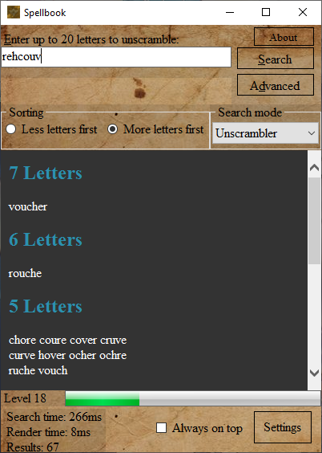
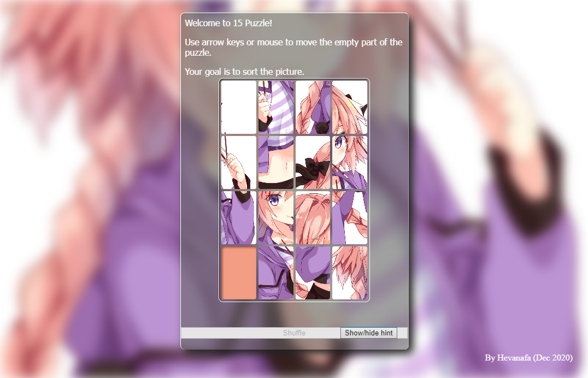
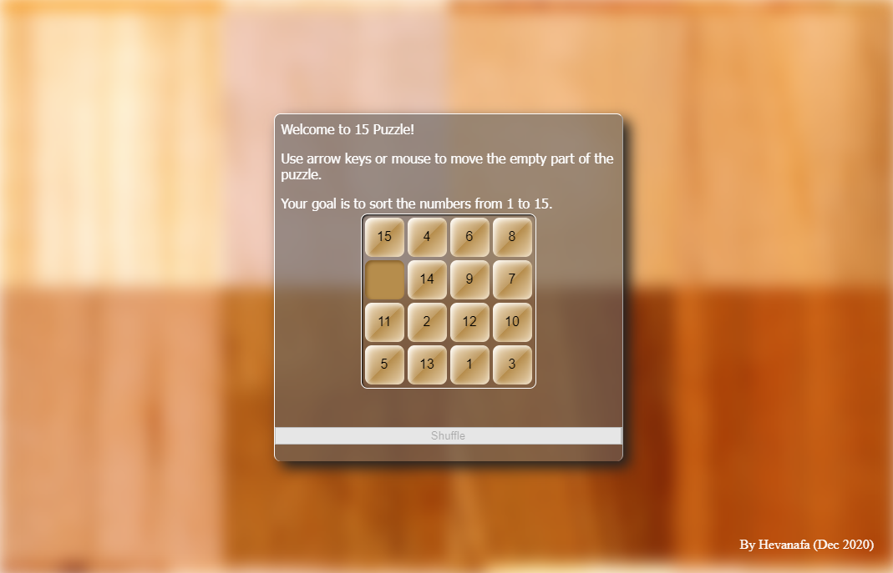

Hi, I’m @Hevanafa

I'm interested in learning computer science & exploring algorithms.

Currently I'm learning Rust and would love to learn more about web dev stacks.

I work as a full-time frontend web developer in a multinational company.

I usually spend time in CodinGame when I'm free.

CodePen: https://codepen.io/hevanafa/

My website: https://hevanafaslime.com

# Personal Projects

## 2022

- Basic Thai IME

- Aksara Jawa converter

- Thai Clock (anime)

- Thai Clock (Kitana)

- Fallout HUD mod for Minecraft 1.18.2

## 2021

- Number Sorter

This is the game that I hope can be finished any time soon.

- Tip Tap

A game project in Unity

- YouTube & BiliBili Thumbnail Downloader

Initially made this with Perl, rewritten in Ruby.

## 2020

- Spellbook (Word Unscrambler)

A utility program to unscramble letters for word games such as Spellspire, Alphabear, Scrabble, Word Battle (Android), and general word games that use scrambled letters to make a word.

- Anime 15 Puzzle

[Play](https://codepen.io/hevanafa/pen/MWjoaVj)

- Classic 15 Puzzle

[Play](https://codepen.io/hevanafa/pen/jOMmxKY)

## Uncategorised by year

- Bahasa Panda
- Scrabble Calculator
- Fancy To-Do List
- Random Minecraft Banner Generator (Prototype)
- Minecraft Enchantment Generator
- Succubus & Goblins
- e621 Downloader
- Danbooru Downloader
- Indexed Bitmap Image Viewer in C

# Programming Languages

I'm confident in a few programming languages.

## Usual use at the office
- TypeScript
- Sass
- Ruby (occasionally)

## Confident Enough

I have some experience in the other programming languages as well:

- Rust (currently learning)
- C# (for prototyping, games & desktop apps)
- JavaScript & TypeScript
- Perl (for text file processing & quick scripting)
- Ruby (for file management & prototyping)
- Lua (for Roblox)
- PHP
- Java & Kotlin for Minecraft modding (Java 10+)
- Java MIDP (Java 1.4)
- DBMS: MySQL, Sqlite, Postgres

Only for hobby:

- C++
- Python 3
- C (Turbo C)
- VB .Net
- Java (from MIDP)
- Clojure

I have used these JavaScript frameworks to make projects in the company that I'm working:

- React.js (more than 4 years of experience)
- Socket IO
- Node.js
- Vue.js (only for a few months)
- Phaser 3
- Svelte

🎨 I can draw character illustrations as well, which you can browse on:

- Instagram: @hevanafa
- DeviantArt
- FurAffinity
- InkBunny
- Twitter: @hevanafa and @hevanafa_not13 (🔞)
- Facebook: Dhevan Safa Hevanafa

<!---
Hevanafa/Hevanafa is a ✨ special ✨ repository because its `README.md` (this file) appears on your GitHub profile.
You can click the Preview link to take a look at your changes.
--->
