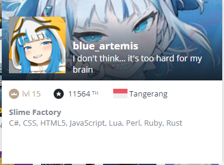

Hi, I’m @Hevanafa

I'm a full-time frontend web dev working in a multinational company.

I'm interested in learning computer science & exploring algorithms.

Currently I'm learning Rust and would love to learn more about web dev stacks.

I usually spend time in CodinGame when I'm free.

CodePen: https://codepen.io/hevanafa/

My website (contains mostly Rust & QBasic tutorials): https://hevanafaslime.com

# My Tech Stack 🌐

# Programming Languages

## Currently Learning

## Intermediate Experience

- **.NET**: C# & Visual Basic .NET
- **Java**: both modern Java & Java MIDP 2.0

## Code Editors

## Usual Office Use

For file management & prototyping:

## Coding for Hobby

- Java & Kotlin for Minecraft modding (Java 10+)
- DBMS: MySQL, Sqlite, Postgres

- **Java**: MIDP 2.0

I have used these frameworks to make projects in the company that I'm working:

JavaScript & TypeScript:

- React.js (more than 5 years of experience)
- Socket IO
- Node.js
- Deno
- Vue.js (only for a few months)
- Phaser 3
- Svelte
- Node thermal printer for Kiosk Thermal Printer 80mm

Rust:

- Tauri
- Actix.io

🎨 I can draw character illustrations as well, which you can browse on:

- Instagram: @hevanafa
- DeviantArt
- FurAffinity
- InkBunny
- Twitter: @hevanafa and @hevanafa_not13 (🔞)
- Facebook: Dhevan Safa Hevanafa

# Personal Projects

## 2023

- Roblox Anti-AFK

- The Sewer is the Fastest Way to go to School! (WIP)

A game made entirely with QBasic 4.5 code built with VBDOS 1.0 IDE.

## 2022

- Basic Thai IME

- Aksara Jawa converter

- Thai Clock (anime)

- Thai Clock (Kitana)

- Fallout HUD mod for Minecraft 1.18.2

## 2021

- Number Sorter

This is the game that I hope can be finished any time soon.

- Tip Tap

A game project in Unity

- YouTube & BiliBili Thumbnail Downloader

Initially made this with Perl, rewritten in Ruby.

## 2020

- Spellbook (Word Unscrambler)

A utility program to unscramble letters for word games such as Spellspire, Alphabear, Scrabble, Word Battle (Android), and general word games that use scrambled letters to make a word.

- Anime 15 Puzzle

[Play](https://codepen.io/hevanafa/pen/MWjoaVj)

- Classic 15 Puzzle

[Play](https://codepen.io/hevanafa/pen/jOMmxKY)

## Uncategorised by year

- Bahasa Panda
- Scrabble Calculator
- Fancy To-Do List
- Random Minecraft Banner Generator (Prototype)
- Minecraft Enchantment Generator
- Succubus & Goblins
- e621 Downloader
- Danbooru Downloader
- Indexed Bitmap Image Viewer in C

<!---
Hevanafa/Hevanafa is a ✨ special ✨ repository because its `README.md` (this file) appears on your GitHub profile.
You can click the Preview link to take a look at your changes.
--->
